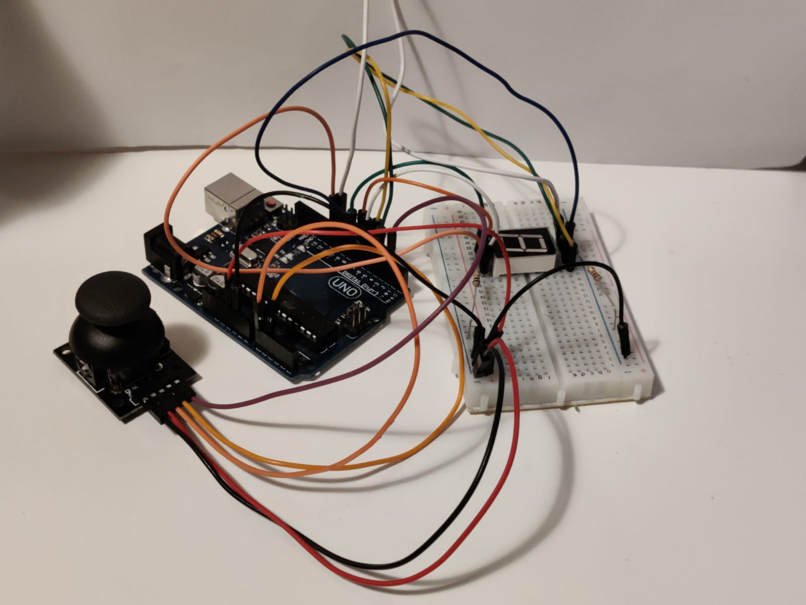

# **Introduction to Robotics (2022 - 2023)**
Introduction to Robotics laboratory homeworks, taken in the 3rd year at the Faculty of Mathematics and Computer Science, University of Bucharest. 

Each homework includes requirements, implementation details, code and image files.

---

## **Contents**  <a id="0"></a>
- Homework 1 - [RGB LED](#hw1)
- Homework 2 - [Crosswalk](#hw2)  
- Homework 3 - [7-Segment Display Controlled by Joystick](#hw3)
- Homework 4 - [4 Digit 7-Segment Display Controlled by Joystick](#hw4)
- Homework 5 - [TBA](#hw5)

---

## **Homework 1 - RGB LED :bulb:** <a id="hw1"></a> [:top:](#0)

### **Technical Task.**
Control of each RGB led color using an independent potentiometer. This has to be done with digital electronics using Arduino functionalities. Read the values of the potentiometers and write a value mapped to each of the pins connected to the LED.

### **Components.**
- RBG LED  (at least one)
- potentiometers  (at least three)
- resistors and wires (according to logic)

### **Process explanation.** ([code](./Homework_1/hw1-potentiometer_rgb/hw1-potentiometer_rgb.ino))
I connected each of the three potentiometers to Analog pins 0 (Red), 1 (Green), and 2 (Blue). Using Arduino I read the values indicated by the potentiometers, processed them and transmitted them to the RGB LED through PWM pins 9 (Red), 10 (Green) and 11 (Blue).

Integrate the following piece into the main [code](./Homework_1/hw1-potentiometer_rgb/hw1-potentiometer_rgb.ino) to see the RGB values.

```
  Serial.print("R: ");
  Serial.print(redBrightness);
  Serial.print(", G: ");
  Serial.print(greenBrightness);
  Serial.print(", B: ");
  Serial.println(blueBrightness);
```

### **Pictures of the setup.**

|  |  | 
|:-------------:|:-------------:|
|  |  |

### **Video showcasing functionality.** [here](https://youtu.be/BMWLpSUMGW8)
  
---

## **Homework 2 - Crosswalk :traffic_light:** <a id="hw2"></a> [:top:](#0)
### **Technical Task.**
Building  the  traffic  lights  for  a  crosswalk. To represent the pedestrian traffic light, use two LEDs (green and red), and for the car traffic light, use three LEDs (one green, yellow and red). 

The traffic light will have **4 states** and will cascade through each of them when the button is pressed:

- **State 1** (aka default state): green light for cars, red light for pedestrians and no beeping sound.  
Duration: indefinite, changed by pressing the button.

- **State 2** yellow light for cars, still red light for pedestrians and no beeping sound.  
Duration: starts with a delay of 8 seconds after the button is pressed and lasts for 3 seconds.

- **State 3**: red light for cars, green light for pedestrians and beeping sound.  
Duration: 8 seconds.

- **State 4**: red light for cars, blinking green light for pedestrians and beeping sound is faster.  
Duration: 4 seconds.

**Attention**: pressing  the  button  in  any  state  other  than  state  1  should not yield any actions.

### **Components.**
- 5 LEDs
- button
- buzzer
- resistors and wires (according to logic)

### **Process explanation.** ([code](./Homework_2/hw2/hw2.ino))
I connected each of the LEDs, the button and the buzzer to a Digital pin. Each component has a dedicated resistor, apart from the button. The button uses the _pull-up resistor_ from the Arduino UNO, due to breadboard space considerations.

The ``` state ``` variable stores the state the program is about to enter. At the end of a state, its end time is stored in the variable ``` lastStateTime ``` to calculate the execution time of the next state.

Each state has a dedicated function that changes the states of the LEDs according to its specifications.

The program starts in State 1. When the button is pressed, debounce is used to ignore missed signals. If a signal is constant, then the program goes, in that order, through states 2, 3 and 4. At the end it returns to State 1. From here the button can be pressed again to start a new process. The system accepts an input only if State 1 is active (``` state == 1 ```).

### **Pictures of the setup.** 

|  |  | 
|:-------------:|:-------------:|
|  |  |

### **Video showcasing functionality.** [here](https://youtu.be/AADY6tSfnSc)
  
---

## **Homework 3 - 7-Segment Display Controlled by Joystick :eight: :video_game:** <a id="hw3"></a> [:top:](#0)
### **Technical Task.**
With the help of a joystick navigate through the segments of a 7-segment display and "draw" on the display. The movement between segments should be natural: they should jump from the current positiononly to neighbors, but without passing through "walls".

Below are the possible moves for each segment (neighbors of a segment):  
  
  

| Current Segment | UP | DOWN | LEFT | RIGHT | 
|:-----:|:-----:|:-----:|:-----:|:-----:|
| **a** | N/A | g | f | b |  
| **b** | a | g | f | N/A |
| **c** | g | d | e | dp |
| **d** | g | N/A | e | c |
| **e** | g | d | N/A | c |
| **f** | a | g | N/A | b |
| **g** | a | d | N/A | N/A |
| **dp** | N/A | N/A | c | N/A |


The system will have **2 states**:

- **State 1** (aka default, but also initiated after button press in state 2): Current position blinking. Can use the joystick to move from one  position to neighbors. **Short pressing** the button toggles state 2. **Long pressing** the button in state 1 resets the entire display by turning all the segments OFF and moving the current position to the Decimal Point.

- **State 2** (initiated after button press in state 1): The current segment stops blinking, adopting the state of the segment before selection (ON or OFF). **Toggling the X axis** changes the segment state from ON to OFF  or from OFF to ON. Clicking the joystick saves the segment state and exits back to state 1.

### **Components.**
- 7-segment display
- joystick
- resistors and wires (according to logic)

### **Process explanation.** ([code](./Homework_3/hw3/hw3.ino))  
:soon:

Integrate the following piece into the main [code](./Homework_4/hw4/hw4.ino) to help you see your joystick values and set the thresholds accordingly.
```
  Serial.print("xValue: ");
  Serial.print(xValue);
  Serial.print(", yValue: ");
  Serial.print(yValue);
  Serial.print(", swValue: ");
  Serial.println(swValue);
```

### **Pictures of the setup.**

|  |  | 
|:-------------:|:-------------:|
|  |  |

### **Video showcasing functionality.** [here](https://youtu.be/Br4ySRPxguE)

---

## **Homework 4 - 4 Digit 7-Segment Display Controlled by Joystick :1234: :video_game:** <a id="hw4"></a> [:top:](#0)
### **Technical Task.**
Use the joystick to move through the 4 digit 7-segment displays digits, press short the button to lock in on the current digit and use the other axis to increment or decrement the number. Keep the button pressed to reset all the digit values and the current position to the first digit in the first state.

The system will have **2 states**:

- **State 1**: Use a joystick X axis to cycle through the 4 screen digits;
using the Y axis does nothing. A blinking Decimal Point shows
the current digit position. When **short pressing** the button, you lock in on the selected digit and enter state 2. **Long pressing** the button only in state 1, all the digits go back to 0 and the current position is set to the first (rightmost) digit, in the first state.

- **State 2**: The Decimal Point stays always on, no longer blinking and you can no longer use the X axis to cycle through the 4 digits. Instead, using the Y axis, you can increment or decrement the number on the current digit _in hex_ (from 0 to F). Pressing the button again returns you to the
previous state. When changing the number, you must increment it for each joystick movement - it should not work continuosly increment if you keep the joystick in one position.

### **Components.**
- 4 digit 7-segment display
- joystick
- 74hc595 shift register
- resistors and wires (according to logic)

### **Process explanation.** ([code](./Homework_4/hw4/hw4.ino))  
:soon:

### **Pictures of the setup.**

|  |  | 
|:-------------:|:-------------:|
|  |  |

### **Video showcasing functionality.** [here](https://youtu.be/Nn4dM_5IZQ8)

---

## **Homework 5** <a id="hw5"></a> [:top:](#0)
TBA